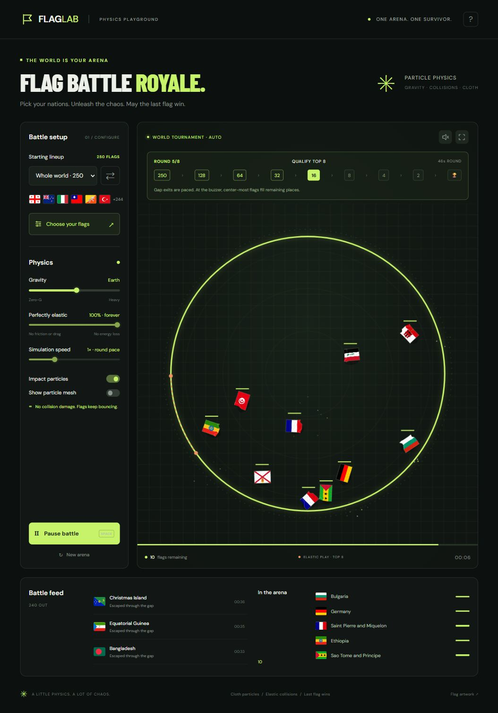

# Flag Battle Royale

A browser game inspired by the supplied Flag Battle Royale HTML. Choose a random or custom lineup of 2–250 countries and territories, then watch flags collide in a rotating-gap arena.

Open **Flag Battle Royale.html** directly for a completely offline, single-file edition. The `dist` folder is the web edition.

[Play the hosted game](https://flag-battle-royale-physics.gamingslayer20.chatgpt.site) (private owner access).

For a local browser preview, run `python -m http.server 8765 --bind 127.0.0.1 --directory dist` from this folder, then open `http://127.0.0.1:8765/`.

## Controls

- Start / pause: Space, or the main button.
- New arena: R. Choose flags: F.
- Search country names or two-letter codes, filter by continent, or paste a comma-separated custom list.
- Lineup choices are remembered on this device when browser storage is available.
- Selecting all 250 flags starts the world tournament automatically; subsequent rounds also start automatically.
- Gravity and particle display can change during play. Collision elasticity is locked at 100%, with no collision damage. Single battles allow speed changes; tournaments use 1× so round countdowns stay meaningful.

## World tournament

The stages are **250 → 128 → 64 → 32 → 16 → 8 → 4 → 2 → champion**. Each of the eight rounds gets a random integer duration of **35–50 seconds of active simulation**. A 2.5-second intermission advances qualifiers automatically. Pausing freezes both countdowns and intermissions; switching away from the page pauses play.

The exit gap opens in paced windows after an eight-second warmup, preventing early rounds from eliminating too many flags at once. At the buzzer, the flags closest to the arena center fill any remaining qualifying places. The next round uses exactly those survivors, and the final selects one champion. A bracket, qualifying target, countdown, and progress bar show the tournament state. Custom lineups below 250 play a single escape battle.

## Simulation

A fixed 120 Hz clock with adaptive substeps uses semi-implicit integration, circle contact impulses, angular motion, positional overlap correction, spatial hashing, and rounded rotating-gap edge contacts. Visible play uses perfectly elastic collision impulses (restitution 1), zero contact friction, zero air drag, zero angular drag, no speed cap, and no collision damage. Adaptive substeps protect fast bodies from tunneling without slowing them down. Gravity and moving gap edges can exchange energy with flags; the collision response itself does not dissipate energy.

Each flag is drawn onto a spring-connected particle grid with shape-restoring forces and inertia, so the cloth flexes independently after collisions. Its visual cloth skin settles independently of the lossless rigid collider. Circular collision hulls protect the deformable flag mesh; this is a game physics approximation, not a full finite-element cloth solver. Eliminated flags break into textured particles. The legacy inelastic engine option remains available only for regression tests, not in the visible controls.

Includes 249 ISO country and territory flags plus Kosovo (250). Flag artwork and country metadata are from [flag-icons](https://github.com/lipis/flag-icons), under its MIT license. See `dist/flag-icons-LICENSE.txt` for attribution.

## Validation and export

Run `node --test tests/physics.test.cjs` for collision, gap, stability, and frame-rate checks. Run `python tools/export_standalone.py` after changing the web edition to refresh the offline file. `tools/prepare_flags.py` refreshes the bundled flags and requires a network connection.
